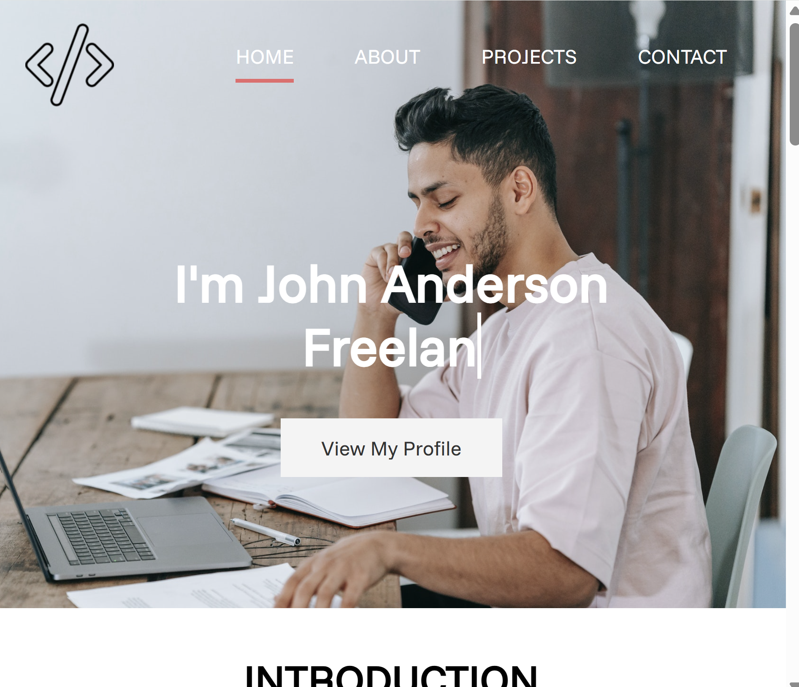
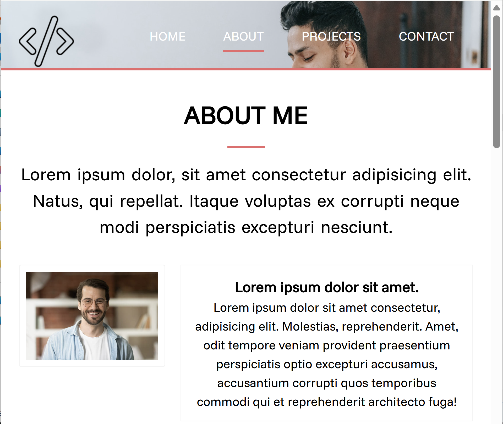
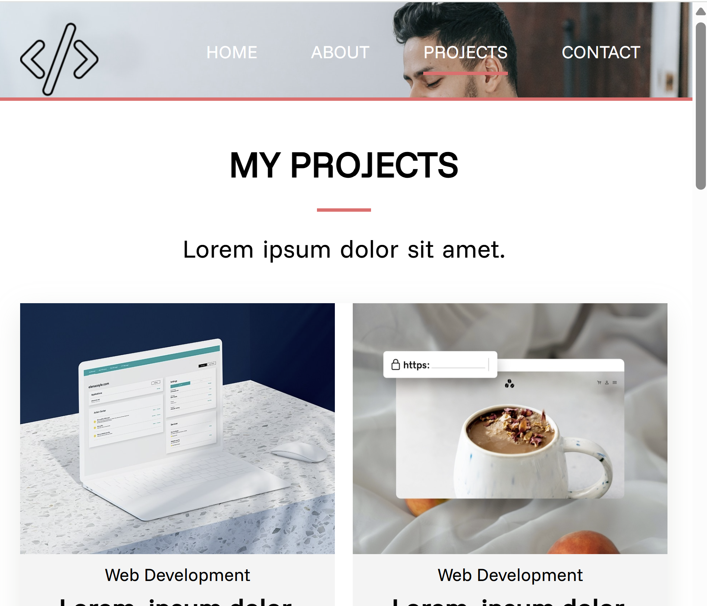
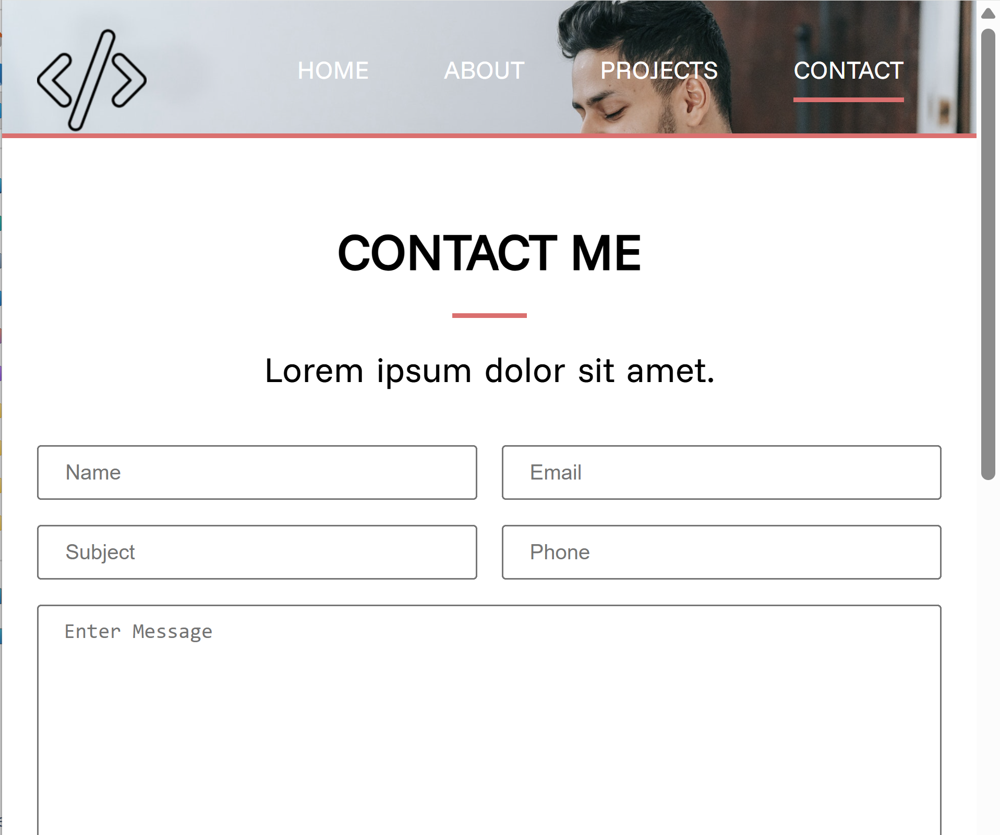

# 💼 Freelancer Portfolio Website

Geliştiricinin yeteneklerini, projelerini ve iletişim bilgilerini sergilemek için hazırlanmış **modern**, **responsive** ve **çok sayfalı** bir kişisel portföy sitesidir.

<p align="left">
  <a href="https://img.shields.io/badge/status-active-success">  </a>
  <a href="https://img.shields.io/badge/license-MIT-informational">  </a>
  <a href="https://img.shields.io/badge/tech-HTML5%20%7C%20CSS3%20%7C%20JavaScript-blue">  </a>
</p>

---

## 📷 Önizleme

<p align="center">
  
  
  
  

</p>

---

## ✨ Özellikler

- Çok sayfalı yapı: **Home, About, Projects, Contact**
- Typewriter animasyonu ile dinamik başlık
- Owl Carousel ile referans slider’ı
- Lightbox2 ile proje galeri görünümü
- İletişim formu, sosyal medya bağlantıları ve ikon setleri
- Tamamen **responsive** ve mobil uyumlu arayüz

---

## 🛠️ Teknolojiler

- **HTML5**
- **CSS3**
- **JavaScript (Vanilla JS)**
- **Animate.css**
- **Font Awesome**
- **Owl Carousel**
- **Lightbox2**

---

## ⚙️ Kurulum ve Çalıştırma

```bash
# Depoyu klonla
git clone https://github.com/HilalOnler/freelancer.git

# Klasöre gir
cd freelancer

# Tarayıcıda aç (sadece index.html'i açman yeterli)
# Windows
start index.html
# macOS
open index.html
# Linux
xdg-open index.html
```

---

## 🧭 Sayfa Yapısı

- **Home (index.html)** — Giriş, yetenekler, istatistikler
- **About (about.html)** — Geliştirici hakkında bilgiler, beceri grafikleri, referanslar
- **Projects (projects.html)** — Projelerin galeri şeklinde tanıtımı
- **Contact (contact.html)** — İletişim formu ve sosyal bağlantılar

---

## 🌐 English (Short)

**Freelancer Portfolio** is a modern, responsive and multi-page personal website  
to showcase developer **skills, projects and contact information**, built with **HTML, CSS and JS**.

---

## 🤝 Katkı (Contributing)

Öneriler ve katkılar memnuniyetle karşılanır! Lütfen bir **issue** açın veya **pull request** gönderin.

---

## 📄 Lisans

Bu proje **MIT** lisansı ile lisanslanmıştır. Ayrıntılar için `LICENSE` dosyasına bakın.
